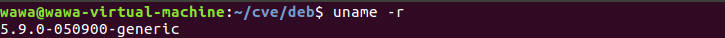
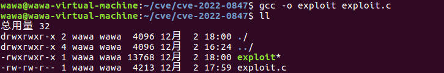
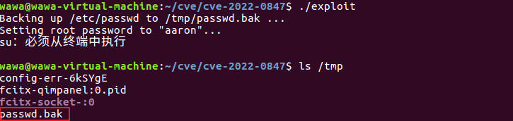
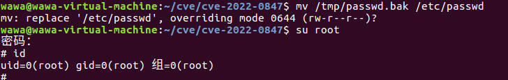

## 
CVE-2022-0847: The Dirty Pipe Vulnerability

 

<!-- TOC -->

- [CVE-2022-0847: The Dirty Pipe Vulnerability](#cve-2022-0847-the-dirty-pipe-vulnerability)
  - [1 漏洞描述](#1-漏洞描述)
  - [2 触发原因](#2-触发原因)
    - [2.1 页面缓存Page Cache](#21-页面缓存page-cache)
    - [2.2 管道pipe](#22-管道pipe)
    - [2.3 `splice()`到`copy_page_to_iter_pipe()`](#23-splice到copy_page_to_iter_pipe)
  - [3 漏洞复现](#3-漏洞复现)
    - [3.1 利用原理](#31-利用原理)
    - [3.2 具体操作](#32-具体操作)
  - [4 参考链接](#4-参考链接)

<!-- /TOC -->

### 1 漏洞描述
Linux 5.8 或更高版本的系统由于未初始化的变量, 存在权限提升漏洞，具备低权限的攻击者可以通过本地访问利用此漏洞，成功利用该漏洞可以导致任意文件写，存在代码注入风险，提权风险，影响机密性，完整性，可用性，原理类似于Dirty Cow linux提权。

该漏洞影响版本Linux Kernel >=5.8.0，目前在Linux 5.16.11、5.15.25、5.10.102已得到修复。

### 2 触发原因
触发漏洞的原因与pipe buffer的零拷贝和初始化流程有关。调用`splice`函数可以通过“零拷贝”的形式将文件发送到pipe，代码层面的零拷贝是直接将文件缓存页（page cache）作为pipe的buf页使用。这里引入了一个变量未初始化漏洞，导致文件缓存页会在后续pipe通道中被当成普通pipe缓存页而被续写进而被篡改。在这种情况下，内核并不会将这个缓存页判定为“脏页”，短时间内不会刷新到磁盘。此时所有访问该文件的场景都将使用被篡改的文件缓存页，也就达成了一个“短时间内对任意可读文件任意写”的状况，进而实现本地提权。

为了完全理解发生了什么，首先需要了解一些特定的内核内部结构。

#### 2.1 页面缓存Page Cache

文件一般存放在硬盘中，CPU并不能直接访问硬盘中的数据，而是需要先将硬盘中的数据读入到内存中，然后才能被CPU访问。为了避免每次读写文件时，都需要对硬盘进行读写操作，Linux内核使用页面缓存机制来对文件中的数据进行缓存。

具体来说，Linux内核会以页大小（4KB）为单位，将文件划分为多个数据块。当用户对文件中的某个数据块进行读写操作时，内核首先会申请一个内存页（也就是页面缓存）与文件中的数据块进行绑定。当用户对文件进行读写时，实际上对文件的页面缓存进行读写：
+  	当从文件中读取数据时，如果要读取的数据所在的页面缓存已经存在，那么就直接把页面缓存的数据拷贝给用户。否则，内核首先会申请一个空闲的内存页（页面缓存），然后从文件中读取数据到页面缓存，再把页面缓存的数据拷贝给用户。
+  当向文件中写入数据时，如果要写入的数据所在的页面缓存已经存在，那么直接把新数据写入到页面缓存。否则，内核首先会申请一个空闲的内存页（页面缓存），然后从文件中读取数据到页面缓存，再把新数据写入到页面缓存。对于被修改的页面缓存，即这种和磁盘数据不一致的页称为脏页（dirty page），脏页会在合适的时机同步到磁盘。
   
上述内容意味着，如果系统上的任何进程（或内核本身）从已经缓存的文件中请求数据，则使用的是缓存的数据而不是访问磁盘。当然，在打开文件时使用标志`（O_DIRECT | O_SYNC）`或显式地指示内核同步脏页面会影响这个行为。我们还可以使用sysfs伪文件系统丢弃缓存的页面：`#echo 1 > /proc/sys/vm/drop_caches`。但是在大多数情况下，缓存的数据是内核（也就是用户进程）最终使用的数据。

此时，我们可以了解Dirty Pipe漏洞的全部内容：
> 它允许我们覆盖任意可读文件的缓存数据（只读是一个充分条件），而页面缓存实际不会标记覆盖页面为脏页面。因此，我们可以欺骗系统认为文件内容发生了变化（在一段时间内）而不在磁盘上留下痕迹。

#### 2.2 管道pipe
Pipes是类UNIX操作系统中的一种单向进程间通信(IPC)机制。本质上，pipe是一个伪文件（实为内核空间中的缓冲区，内核使用环形队列机制，借助内核缓冲区实现），进程通过文件描述符访问它，单向性意味着有两种类型的文件描述符：一个表示读端，一个表示写端。规定数据从管道的写端流入管道，从读端流出管道。

**Pipe是如何实现的？** 通常pipe缓存空间总长度为65536个字节，用页的形式进行管理，总共16页，页面之间并不连续，而是通过数组进行管理，形成一个环形链表。维护两个链表指针，一个用来写（pipe->head），一个用来读（pipe->tail）。

Pipes Writing：通过查看pipe inode的文件操作，我们可以看到对pipe的写入是由 pipe_write() 处理的。具体流程：
>①	如果当前管道不为空（即`head!=tail`），则说明当前管道中有未被读取的数据，那么就获取head指针（也就是指向最新的用来写的页），查看该页的len、offset（为了找到数据末尾）。接下来尝试在当前页面续写。
②	判断当前页面是否带有`PIPE_BUF_FLAG_CAN_MERGE`标记，如果没有则不允许在当前页面续写。或者当前写入的数据拼接在之前的数据后面长度超过一页（即写入操作跨页），如果跨页，则无法续写。
③	如果无法在上一页续写，则另起一页。
④	`alloc_page()`申请一个新的页。
⑤	将新的页放在数组最前面，初始化值。
⑥	buf->flag默认初始化为`PIPE_BUF_FLAG_CAN_MERGE`，因为默认状态是允许页可以被续写的。
⑦	拷贝写入的数据，没拷贝完重复上述操作。

对pipe读写的总结：
1. 	如果设置了 `PIPE_BUF_FLAG_CAN_MERGE` 标志，则写入管道可以附加到 pipe_buffer 的页面。
2.	默认情况下，为通过写入初始化的缓冲区设置此标志。
3.	使用 `read()` 清空管道会使 pipe_buffers 的标志保持不变。
漏洞利用的关键就是在splice中未被初始化的`PIPE_BUF_FLAG_CAN_MERGE`标记。

#### 2.3 `splice()`到`copy_page_to_iter_pipe()`
除了读取和写入，Linux还提供splice系统调用，用于将数据移出或移入管道。它本质上是在内核空间中直接从一个文件描述符复制（不是真正的副本）到另一个文件描述符。前面提到，pipe通过管理16个页作为缓存。splice的零拷贝方法就是，直接用文件页面缓存来替换pipe的缓存页，即更改pipe缓存页指针指向文件页面缓存。

漏洞所在的`copy_page_to_iter_pipe()`函数主要的工作就是将pipe缓存页结构指向要传输的文件的文件页面缓存：
1. 首先根据pipe页数组环形结构，找到当前写指针pipe->head位置。
2. 将当前需要写入的页指针指向准备好的文件页面缓存，并设置其他信息，比如len是由splice系统调用的传入参数决定的，但唯独没有初始化buf->flag，造成漏洞。

### 3 漏洞复现
#### 3.1 利用原理
根据披露作者的操作，大概分为以下几步：
   1. 	创建一个管道；
   2. 	将管道通过pipe_write填满，这样所有的buf（pipe缓存页）都初始化过了，flag默认初始化为`PIPE_BUF_FLAG_CAN_MERGE`；
   3.	将管道通过`pipe_read()`清空，这样通过splice系统调用传送文件的时候就会使用原有的初始化的buf结构；
   4.	调用`splice()`函数将想要篡改的文件传送；
   5.	继续向pipe写入内容，这时就会覆盖到文件的页面缓存里了，完成暂时的文件篡改。

限制是：
   1. 攻击者必须具有读取权限（因为它需要将页面`splice（）`到管道中）
   2. 偏移量不能在页面边界上（因为该页面的至少一个字节必须已拼接到管道中）
   3. 写入不能跨越页面边界（因为将为其余部分创建一个新的匿名缓冲区）
   4. 文件不能调整大小（因为管道有自己的页面填充管理，不会告诉页面缓存有多少数据被追加）

#### 3.2 具体操作
这里利用的Linux内核版本为 Linux 5.9.0，如若版本过低可以参考以下内容进行升级，目前版本为Linux 4.15.0。

首先下载。
> wget -c https://kernel.ubuntu.com/~kernel-ppa/mainline/v5.9/amd64/linux-headers-5.9.0-050900_5.9.0-050900.202010112230_all.deb
> wget -c  https://kernel.ubuntu.com/~kernel-ppa/mainline/v5.9/amd64/linux-headers-5.9.0-050900-generic_5.9.0-050900.202010112230_amd64.deb
> wget -c  https://kernel.ubuntu.com/~kernel-ppa/mainline/v5.9/amd64/linux-image-unsigned-5.9.0-050900-generic_5.9.0-050900.202010112230_amd64.deb
> wget -c  https://kernel.ubuntu.com/~kernel-ppa/mainline/v5.9/amd64/linux-modules-5.9.0-050900-generic_5.9.0-050900.202010112230_amd64.deb

下载完毕后安装。
> sudo dpkg -i *.deb

如果报错提示缺少libssl1.1，下载并安装以下内容后重新执行上一步。
> wget http://archive.ubuntu.com/ubuntu/pool/main/o/openssl/libssl1.1_1.1.0g-2ubuntu4_amd64.deb
> sudo dpkg -i libssl1.1_1.1.0g-2ubuntu4_amd64.deb

重启系统后即完成升级，此时Linux内核版本为5.9.0。

**正式攻击:**

exploit.c源自[原作者漏洞披露博文](https://dirtypipe.cm4all.com/)，具体内容可见[exploit](https://github.com/Arinerron/CVE-2022-0847-DirtyPipe-Exploit/blob/main/exploit.c)。
首先利用exploit进行提权，对提权脚本进行编译后运行。
> gcc -o exploit exploit.c
> ./exploit

此时，`/tmp`目录下生成了一个`passwd.bak`文件。

利用低用户权限将其复制到`/etc/passwd`
> mv /tmp/passwd.bak /etc/passwd

此时已提权成功，登录root用户，输入密码为`aaron`，发现成功登录。

### 4 参考链接
[1] https://dirtypipe.cm4all.com/
[2] https://github.com/Arinerron/CVE-2022-0847-DirtyPipe-Exploit

