##
 一种基于USB设备的安全攻击———BadUSB 

[toc]

---
### 1 背景与原理
USB作为一种即插即用的工具，在给人们提供便利的同时，也带来了很多安全威胁。BadUSB是一种基于带有恶意软件编程的USB设备的计算机安全攻击。在USB攻击领域，对于老式USB病毒autorun.inf，现有的任何一个杀毒软件都能防范它，已经不再具备什么安全威胁。与autorun.inf不同，BadUSB利用了USB协议上的漏洞，通过更改USB的内部固件，BadUSB插入后会模拟键盘和鼠标对电脑进行操作，从而执行有害命令或注入恶意payload，并且不会引起杀毒软件、防火墙的注意。此外，因为是在固件级别的应用，格式化U盘根本无法阻止其内部代码的执行。而且Windows、Linux、MAC等各类操作系统不必联网下载专用的驱动程序，向BadUSB烧录程序极为简单，上手较为容易。

BadUSB工作的前提是计算机信任键盘作为有效的输入源，默认情况下，计算机不信任下载的可执行文件，所以会扫描文件以验证其来源和意图，如果可执行文件来自未知开发人员或显示为恶意文件，则计算机会阻止文件运行。但是，如果标准用户打开命令提示符再输入命令，用户计算机将盲目跟随命令而不判断其意图。因而通过模拟键盘，BadUSB可以轻松执行一系列模拟系统上实际用户交互的功能，它使用脚本语言来告诉USB设备一旦插入目标主机该做什么，达到恶意攻击目的。

### 2 准备阶段
#### 2.1 一块支持USB接口的可编程开发板
Arduino开发板；
#### 2.2 编译环境
Arduino IDE。Arduino IDE可以再Windows、Macintosh OS X、Linux三大主流操作系统上运行，基于processing IDE开发。对于初学者来说，极易掌握，同时有着足够的灵活性。
#### 2.3 程序语言
Arduino语言。Arduino语言基于wiring语言开发，是对avr-gcc库的二次封装，不需要太多的单片机基础、编程基础，简单学习后即可快速地进行开发。
 
### 3 BadUSB攻击
攻击流程：

	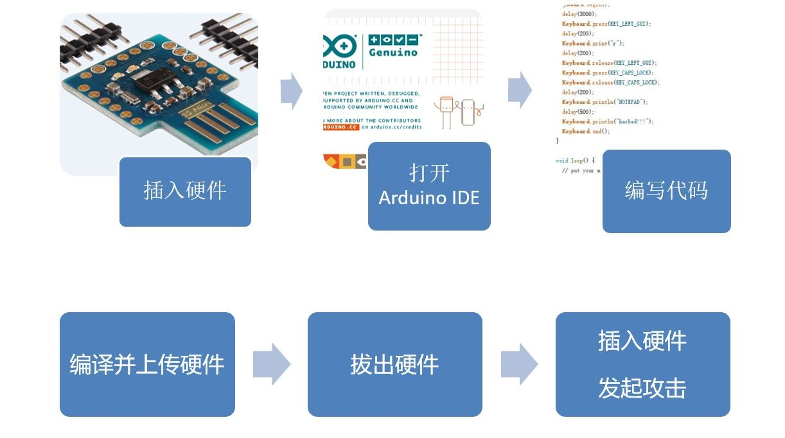

#### 3.1 记事本
该攻击将自动打开电脑的记事本然后向其中输入字符串“hacked！！！”。
##### 3.1.1 程序代码
代码的流程是：开始键盘通讯，延迟3秒（为了保证USB设备成功连接电脑），按下Windows键盘，延迟0.2秒，输入字符串“r”，延迟0.2秒，松开Windows键，按下大小写锁定键，松开大小写锁定键，延迟0.2秒，输入字符串“NOTEPAD”并按下回车键，延迟0.5秒，输入字符串“hacked！！！”并按下回车键，结束键盘通讯。具体代码如下：

	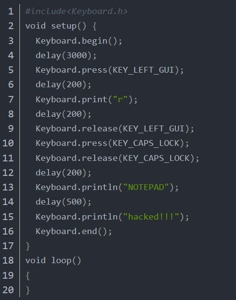

##### 3.1.2 攻击结果

---
#### 3.2 命令行
该攻击将自动打开Windows命令行cmd.exe.
##### 3.2.1 程序代码
代码的流程是：开始键盘通讯，延迟1秒，按下Windows键，延迟0.5秒，松开Windows键，延迟0.5秒，按下大小写锁定键，松开大小写锁定键，输入字符串“cmd.exe”，延迟0.5秒，按下左CTRL键，按下左shift键，按下回车键，延迟0.5秒。具体代码如下。

	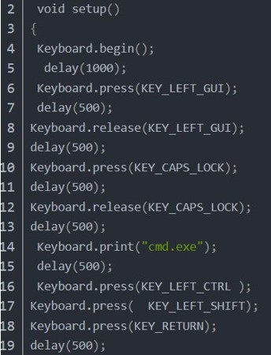

##### 3.2.2 攻击结果

---
#### 3.3 以管理员身份运行命令行
该攻击的目的是自动以管理员身份运行Windows命令行cmd.exe.
##### 3.3.1 程序代码
代码的流程是：松开左CTRL键，松开左shift键，松开回车键，延迟0.5秒，按下左alt键，按下y键，延迟0.5秒，松开左alt键，松开y键，延迟0.5秒，结束键盘通讯。具体代码如下。

	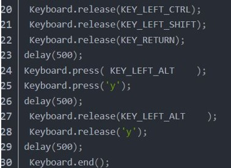

##### 3.3.2 攻击结果

---
#### 3.4 运行命令行并隐藏
该攻击的目的是运行Windows命令行后将其从屏幕上隐藏起来。
##### 3.4.1 程序代码
代码的流程是：开始键盘通讯，延迟3秒，按下Windows键，延迟0.2秒，输入字符串“r”，延迟0.2秒，松开Windows键，按下大小写锁定键，松开大小写锁定键，延迟1秒，输入字符串`CMD  /q /d /f:off /v:on /k MODE con: cols=30 lines=6`并敲回车键，延迟1秒，按下左alt键，延迟0.2秒，按下空格键，延迟0.2秒，松开左alt键，松开空格键，延迟0.2秒，输入字符串“m”，按下左键，延迟3秒，松开左键，按下回车键，结束键盘通讯。具体代码如下。

	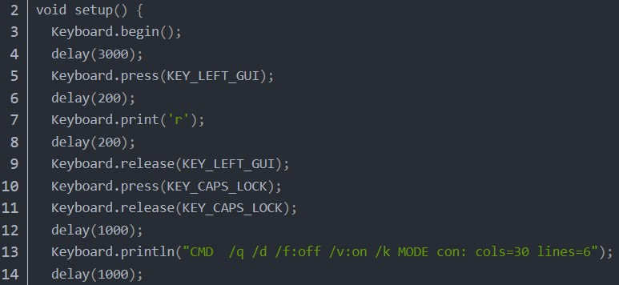

	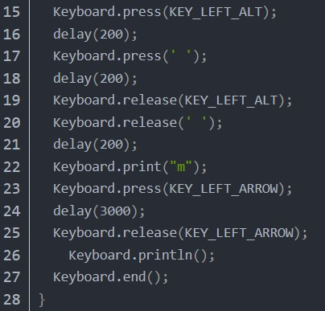

##### 3.4.2 攻击结果

---
#### 3.5 打开Linux命令行
该攻击的目的是自动打开Linux下的命令行terminal并执行指令。
##### 3.5.1 程序代码
代码的流程是：开始键盘通讯，延迟3秒，按下Windows键，延迟0.2秒，松开Windows键，延迟0.5秒，按下大小写锁定键，松开大小写锁定键，延迟0.2秒，输入字符串“terminal”，延迟3秒，按下回车键，延迟3秒，输入字符串“PWD”并敲回车键，延迟1秒，输入字符串“ID”并敲回车键，延迟1秒，输入字符串“CAT /ETC/PASSWD”并敲回车键，延迟1秒，结束键盘通讯。具体代码如下。

	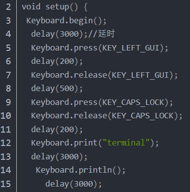

	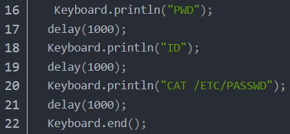

##### 3.5.2 攻击结果

---
#### 3.6 关机
该攻击的目的是对电脑实行强制关机。
##### 3.6.1 程序代码
代码的流程是：开始键盘通讯，延迟3秒，按下Windows键，延迟0.5秒，按下r键，延迟0.5秒，松开Windows键，松开r键，延迟0.5秒，输入字符串“shutdown -s -f -t-0”并敲回车键，结束键盘通讯。具体代码如下。

	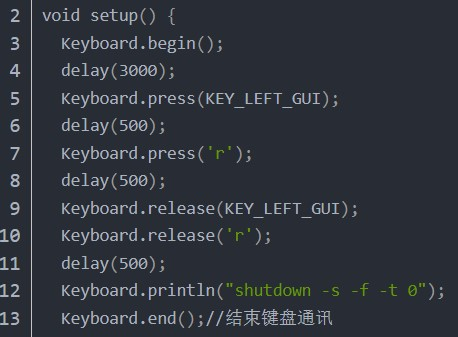

---
#### 3.7 获得root权限
sudo是Linux系统管理指令，是允许系统管理员让普通用户执行一些或者全部的root命令的一个工具。在sudo于1980年前后被写出之前，一般用户管理系统的方式是利用su切换为超级用户，但是使用su的缺点之一是必须要先告知超级用户的密码。sudo使普通用户不需要知道超级用户的密码即可获得权限。具体原理是：首先，超级用户将普通用户的名字、可以执行的特定命令、按照哪种用户或用户组的身份执行等信息等级在特殊的文件中（通常是/etc/sudoers），即完成对该用户的授权（此时称该用户为“sudoer”）；在普通用户需要取得特殊权限时，其可在命令前加上“sudo”，此时sudo将会询问该用户自己的密码以确认终端机前的是用户本人，密码确认正确后系统会将该命令的进程以超级用户的权限运行。之后的一段时间内（默认为5分钟，可在/etc/sudoers中自定义），使用sudo不需要再次输入用户密码。

假设Linux系统中有一个普通用户test，该用户不具备使用sudo指令的权限，也就无法获得root权限来执行root指令。该攻击的目的是通过修改sudo的配置文件sudoers来使用户test成功使用sudo指令执行root特权指令。

	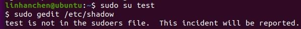

可以看到当test用户想要通过sudo打开影子文件shadow时，终端会显示该用户没有在sudoers文件中配置。sudoers文件内容如下图，test用户条目添加的未知即为光标所在行。

	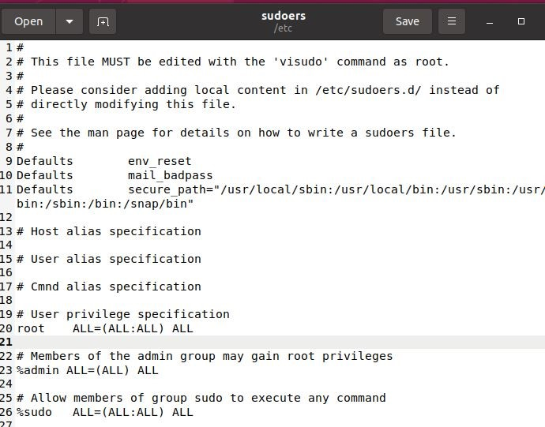

##### 3.7.1 程序代码
代码的流程是：开始键盘通讯，按下Windows键，输入字符串`terminal`，敲击回车键，输入字符串`sudo gedit /etc/sudoers\n`，按下方向下键，松开方向下键，重复21次……输入字符串`test    ALL=(ALL:ALL) ALL`，按下左CTRL键，输入字符串“s”，松开左CTRL键，按下左CTRL键，输入字符串“w”，松开左CTRL键，按下左CTRL键，输入字符串“w”，松开左CTRL键。具体代码如下。

	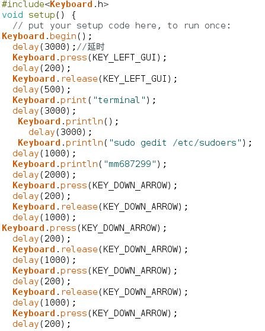

	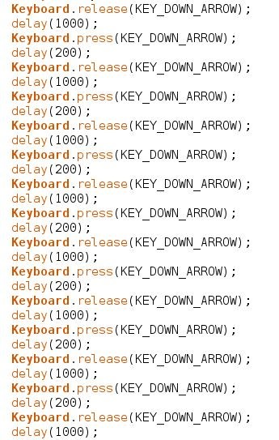

	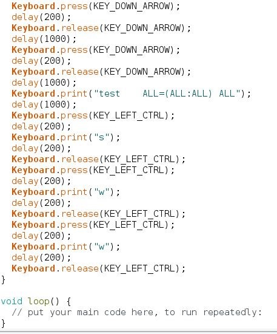

##### 3.7.2 攻击结果

	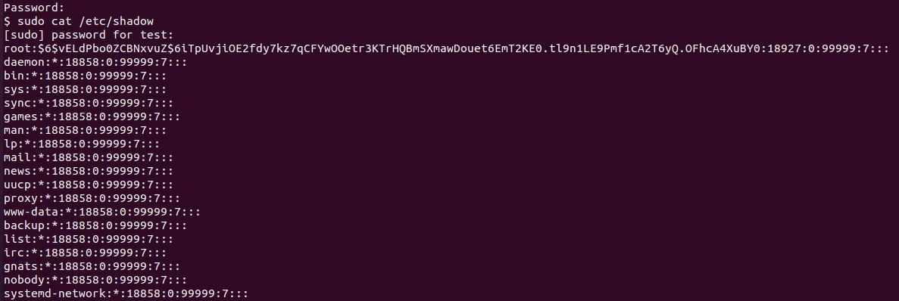

最终test用户成功执行指令`sudo cat /etc/shadow`，打开了影子文件。

---
### 4 BadUSB攻击进阶
此攻击的目的是让电脑运行相应指令，在我们的连接上下载木马程序，并对程序进行免杀，执行木马程序来完成越权提权。
#### 4.1 需要开发板编译运行的程序代码

	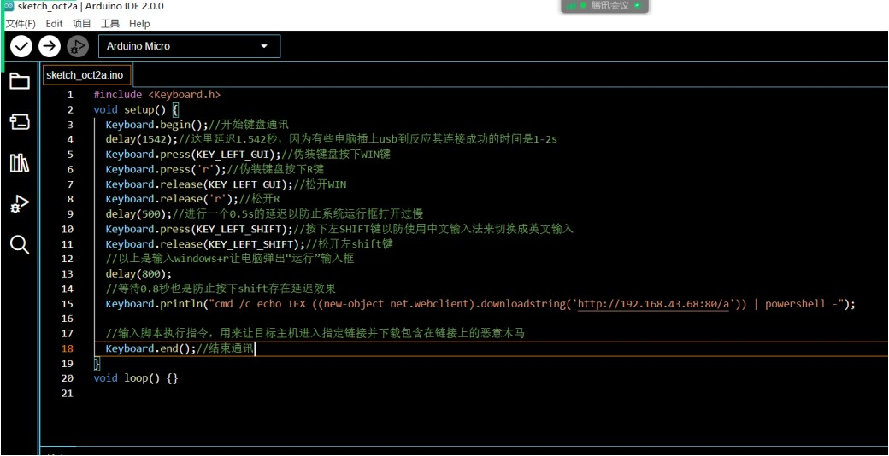

#### 4.2 木马程序
从Github下载木马生成工具CobaltStrike4.0，打开工具之前要设置团队服务器，这里将团队服务器搭建在Kail虚拟机上，运行可执行文件teamserver，后面加上服务端ip和服务器密码，可以看到配置成功：

	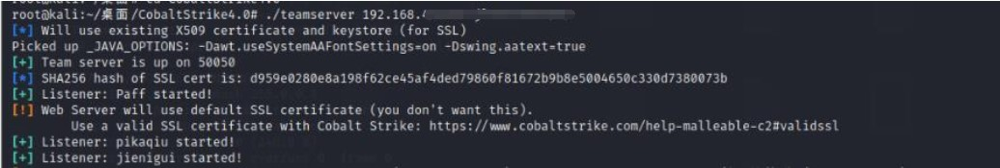

然后打开CobaltStrike4.0目录下的【简体中文版.bat】，配置监听端口，输入服务器ip和设置的密码进行登录，登录之后的页面如下：

	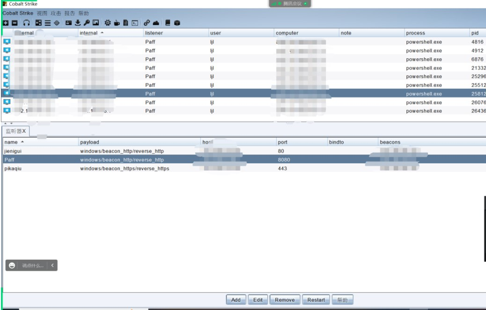

上面的一堆ip地址都是被攻击的目标主机。接下来配置监听器，点击【监听器】，再点击【Add】。

	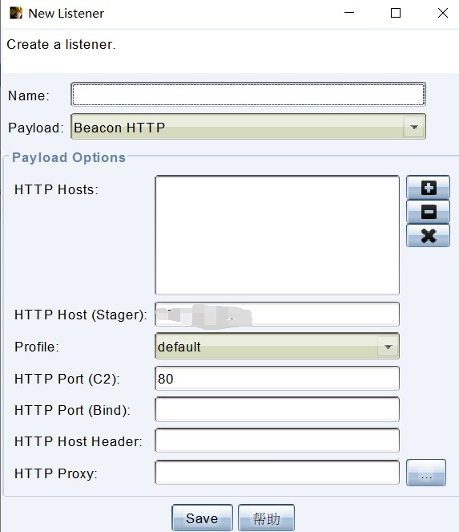

名字可以自定义，http host填写自己服务端ip地址，然后打开80端口进行监听即可。建立监听器之后就可以生成提权木马了，点击【攻击】-【钓鱼攻击】-【脚本化web交互】，得到如下页面：

	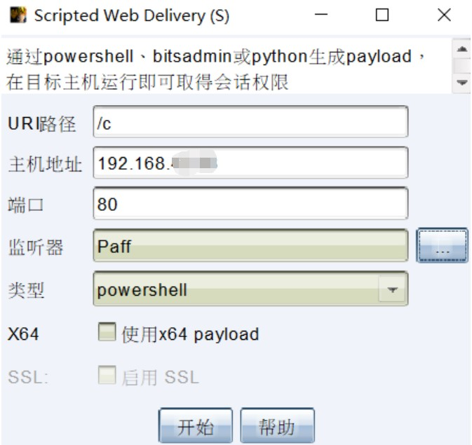

其中url路径可以随便写，端口要与之前设置的端口一致，监听器就选之前建立的监听器即可。

	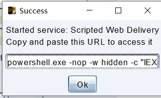

这个url就是之前程序代码中的URL的雏形。为什么说是雏形呢？因为这样生成的木马程序会被电脑的杀毒软件察觉到并杀死。我们还需要对木马程序进行免杀。
#### 4.3 对木马程序进行免杀
首先了解杀毒软件的查杀思路以及常见的查杀方式。
**特征码扫描**
>所谓特征码其实就是程序内部的一串或几串二进制机器码。特征码匹配工作原理是先总结出某个病毒的特征码，然后在目标文件中搜索看有没有类似的匹配，如果有匹配就暂定其为病毒文件。这种方法的优点是速度快，准确率相对较高，很少需要用户参与。但其也存在缺点，面对不断出现的新病毒，采用病毒特征代码法的检测工具必须不断更新病毒库的版本，否则检测工具便会老化，逐渐失去失去实用价值；此外，这种方法对从未见过的新病毒，无法知道其特征代码，因而无法检测新病毒；病毒特征码如果没有经过充分的检验，可能会出现误报，造成数据误删，给用户带来麻烦。

**文件和校验法**
>将正常文件A的hash值保存，然后如果有一个新的A文件发送过来计算其hash值，如果与正常文件的不同，那么认定为病毒文件。

**沙盒检测**
>这是一种基于行为的检测方法，通过观察文件是否有一些敏感的行为来确定文件是否为病毒。这种方法的优点是可具备发现未知病毒的潜力；缺点是误报率相对较高，而且需要用户参与。

**云查杀**
>这种方法类似特征码查杀，只是当特征码库没有相应的匹配值时，会把文件上传到云端继续分析，有时候一开始扫描出来不是病毒，但过一会儿扫描就是病毒了，这种行为就是云查杀。

接下来了解一些免杀方法。

**修改特征码**
>因为大多数杀毒软件都是基于特征码进行查杀的，特征码的具体定义是能够识别一个程序的不大于64字节的字符。修改特征码的原则是不改变程序运行效果。但是由于每个厂商的特征库不同，这种方法需要针对不同的厂商进行特征码的修改，消耗的人力物力都非常大，不够其效果非常不错。

**花指令**
>通过增加一段没有意义的指令（花指令）来达到免杀效果，原理类似修改特征码。例如杀毒软件本来是在0x00001000到0x00005000处找一个特征码，但因为我们填充了花指令，恶意代码文件的特征码跑到了0x00008000这个位置，就会导致特征码查杀失败，从而达到免杀的目的。

**加壳**
>加壳的原理是给原程序加上一段保护程序，保护程序具有保护和加密的功能，运行加壳后的文件是先运行壳再运行真实程序从而起到保护原程序的作用。

**最后是我们的免杀思路。**

其实因为现在杀毒软件的技术的完备性，想手搓一个免杀木马还是十分困难的。但是我们发现通过管道的方式执行恶意代码反而不会被火绒检测到。管道命令指的是将上一条命令的输出，作为下一条命令的输入，两条命令通过“|”连接。最后，下面便是我们修改得到的代码：

	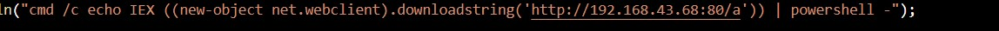

代码的含义是，在cmd里面打开powershell，然后在里面输入前面部分的代码，从而在我们的链接里下载木马程序并执行。通过尝试发现，这种方式杀毒软件似乎检测不到，它只会检测前一条命令的合法性以及后一条命令的合法性，但是并不会检查两条命令组合在一起的合法性。

#### 4.4 攻击结果
插入USB之后，可以看到电脑自动弹出了运行框并在里面输入了上面那行代码，之后反弹权限到了实施攻击的主机上。

可以查看被攻击主机的文件、远程桌面等，如下图所示。甚至还可以在主机上设立后门，从而变成自己的僵尸网络。

	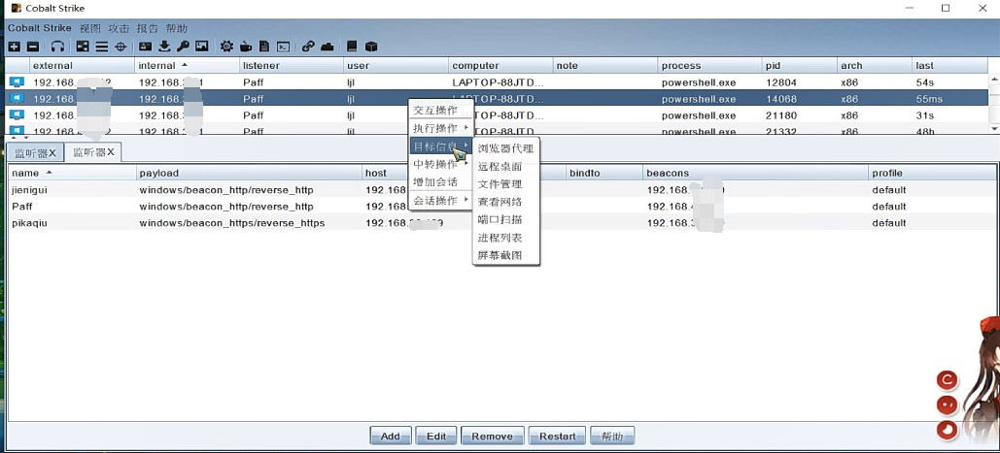

查看文件：

	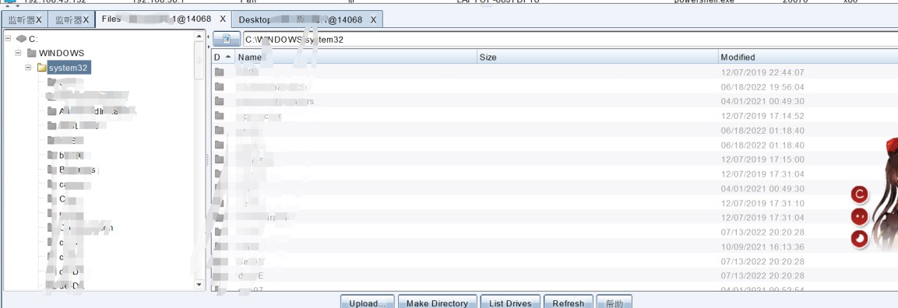

远程桌面：

	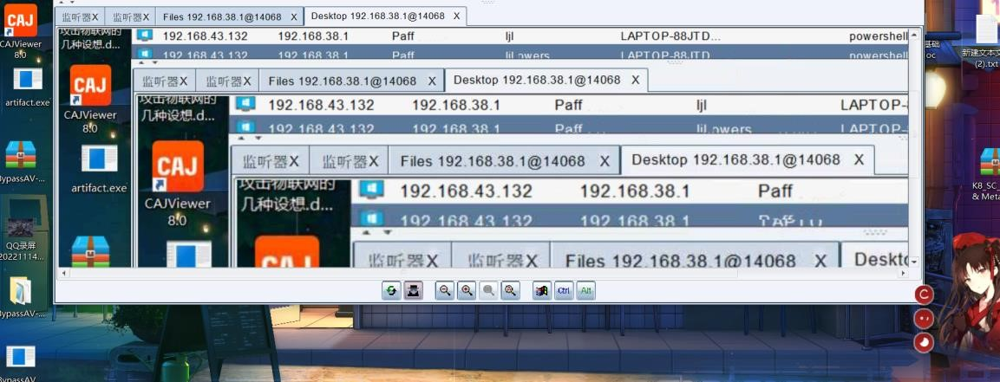

### 5 一些可行的防范措施
#### 5.1 使用专门的程序来监测打字速度
> 由于BadUSB设备的打字速度几乎不可能是人为的，专门的程序会在后台运行并密切关注打字速度，当检测到BadUSB攻击时，程序会有效地阻止键盘输入。
#### 5.2 设置以管理员身份运行CMD的密码
> 设置使用提升的命令提示符的密码会停止任何编程为寻求管理员权限，从而阻止BadUSB攻击。
#### 5.3 安装USB端口阻止程序
> USB端口阻止程序是阻止用户在用户不知情的情况下连接可能包含恶意负载的未经授权的USB设备的有效方法，对于BadUSB攻击，攻击者不太可能以安装了该阻止程序的系统为目标。

### 6 参考文献
[1] 初识BadUSB：https://blog.csdn.net/Peter_FHC/article/details/124994962
[2] E. Karystinos, A. Andreatos and C. Douligeris, "Spyduino: Arduino as a HID Exploiting the BadUSB Vulnerability," 2019 15th International Conference on Distributed Computing in Sensor Systems (DCOSS), 2019, pp. 279-283, doi: 10.1109/DCOSS.2019.00066.
[3] Laiali Almazaydeh,Jun Zhang,Peiqiao Wu,Ruoqi Wei,Yisheng Cheng,Khaled Elleithy．Bad USB MITM: A Network Attack Based on Physical Access and Its Practical Security Solutions[J]．Computer and information science,2018,11(1):1-7

